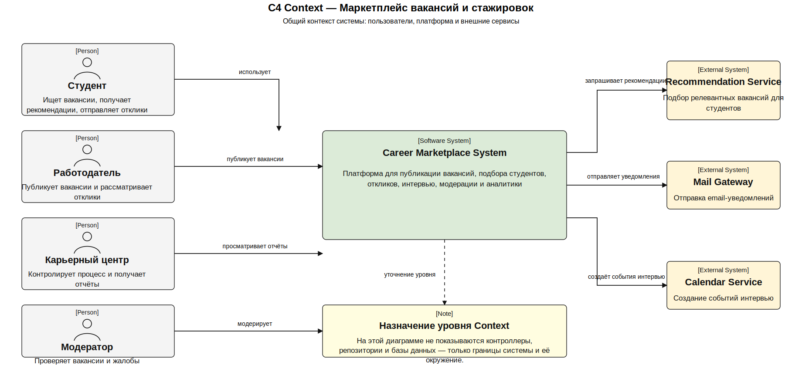
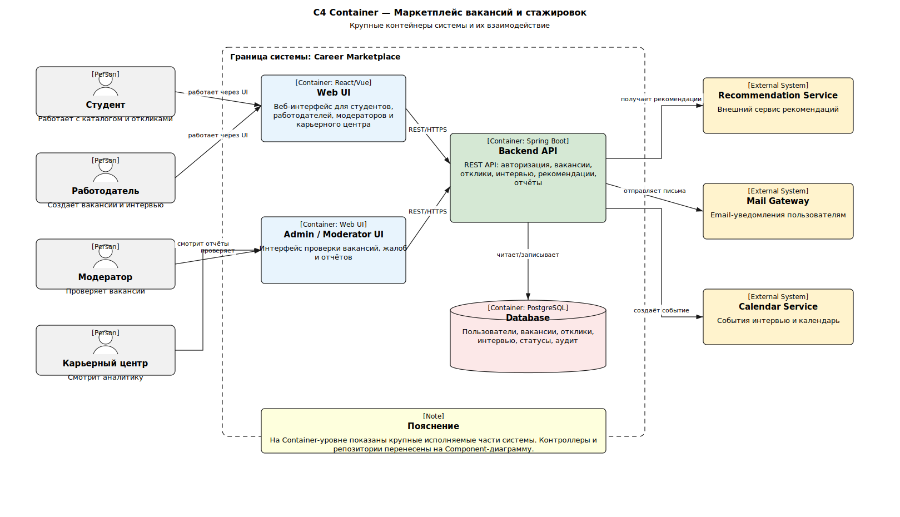
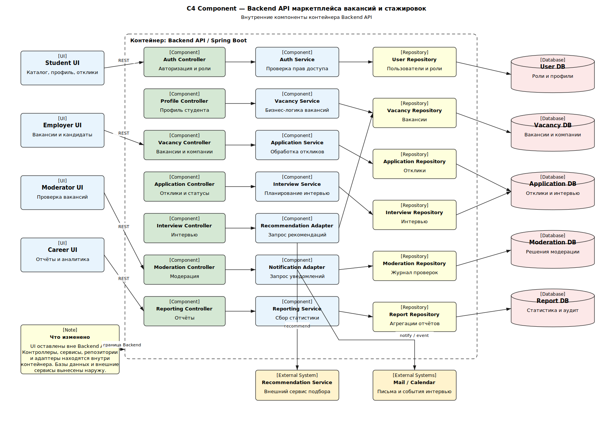

# C4-модель

В разделе представлена C4-модель системы на трёх уровнях: контекст, контейнеры и компоненты. Диаграммы используются как архитектурное описание проектируемого маркетплейса вакансий и стажировок.

## C4 Context

Контекстная диаграмма показывает систему целиком, основных пользователей и внешние сервисы, с которыми взаимодействует маркетплейс.

<small>Контекст системы: пользователи, внешние интеграции и граница проектируемой системы.</small>

## C4 Container

Контейнерная диаграмма показывает крупные программные части системы: пользовательские интерфейсы, backend-сервисы, хранилища данных и внешние интеграции.

<small>Контейнерная схема: интерфейсы, сервисы, базы данных и интеграции.</small>

## C4 Component

Компонентная диаграмма детализирует внутреннее устройство Backend API и показывает, какие компоненты отвечают за авторизацию, вакансии, отклики, рекомендации, интервью, модерацию, уведомления и отчёты.

<small>Компонентная схема Backend API: контроллеры, адаптеры, репозитории и внешние сервисы.</small>
