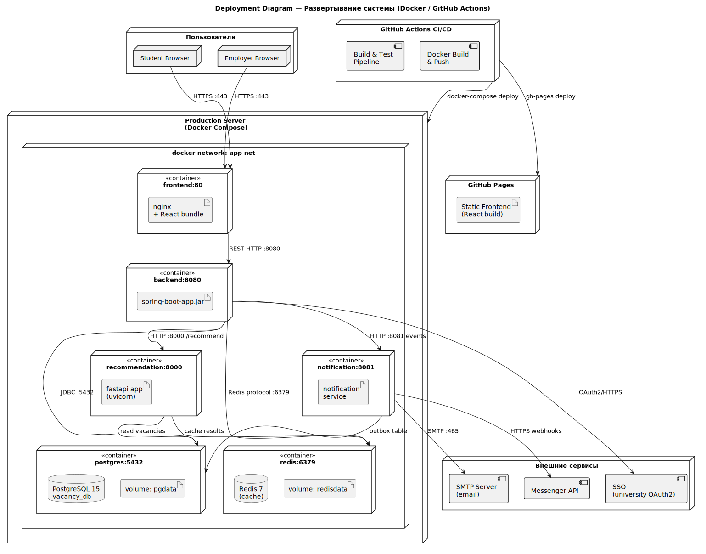

# Развёртывание

Диаграмма развёртывания показывает, как части системы могут быть размещены в инфраструктуре: frontend, backend, сервис рекомендаций, база данных, кэш и внешние интеграции.

<small>Схема развёртывания системы.</small>

Для учебного проекта такая схема достаточна: она показывает основные узлы и связи между ними без лишней детализации инфраструктуры.
