# IDEF0, IDEF3 и DFD

Функциональные модели разбиты по четырём ключевым функциям системы:

1. публикация вакансии работодателем;
2. отклик студента на вакансию;
3. формирование рекомендаций;
4. назначение интервью и изменение статуса.

Диаграммы вставлены как готовые SVG-изображения.

## Функция 1. Публикация вакансии

### IDEF0

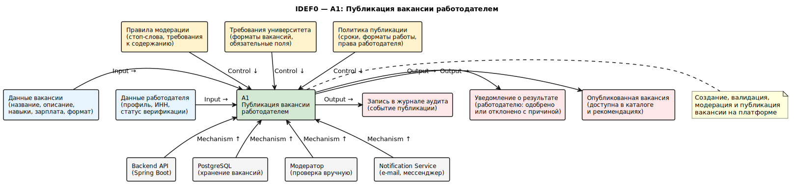

<small>IDEF0 показывает входы, выходы, управляющие факторы и механизмы выполнения функции.</small>

### IDEF3

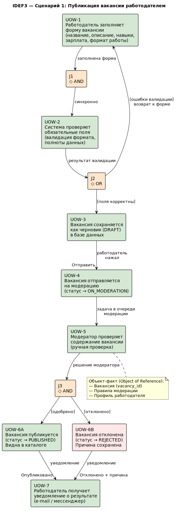

<small>IDEF3 показывает сценарий выполнения процесса и порядок шагов.</small>

### DFD

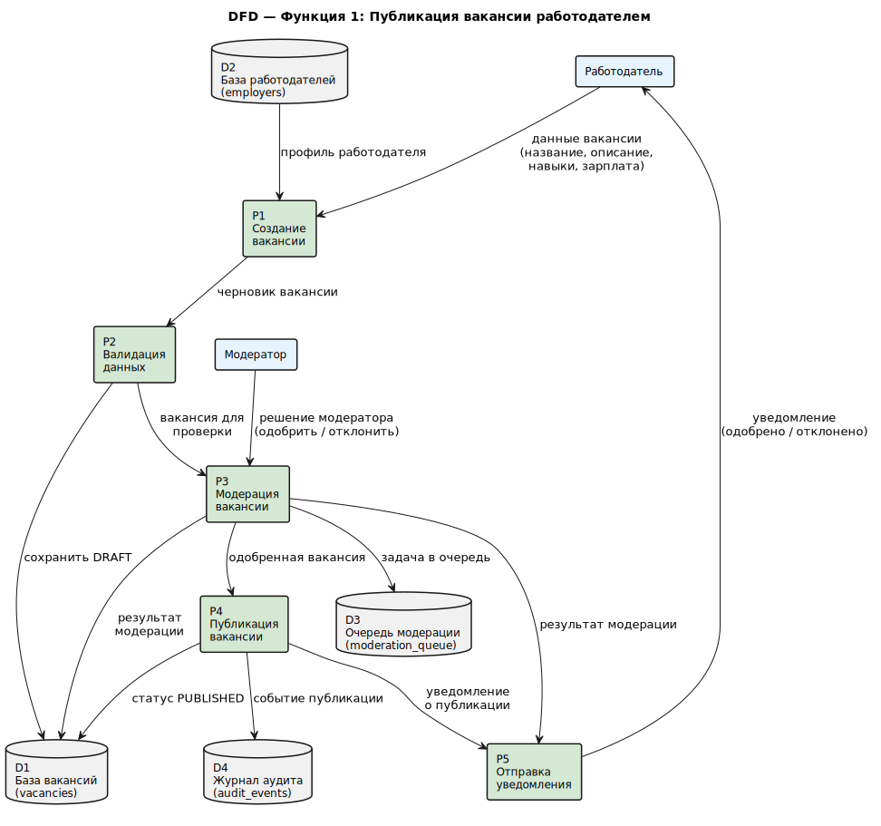

<small>DFD показывает потоки данных между участниками, процессами и хранилищами.</small>

## Функция 2. Отклик студента

### IDEF0

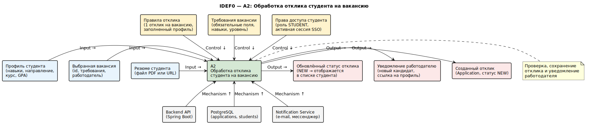

<small>IDEF0 показывает входы, выходы, управляющие факторы и механизмы выполнения функции.</small>

### IDEF3

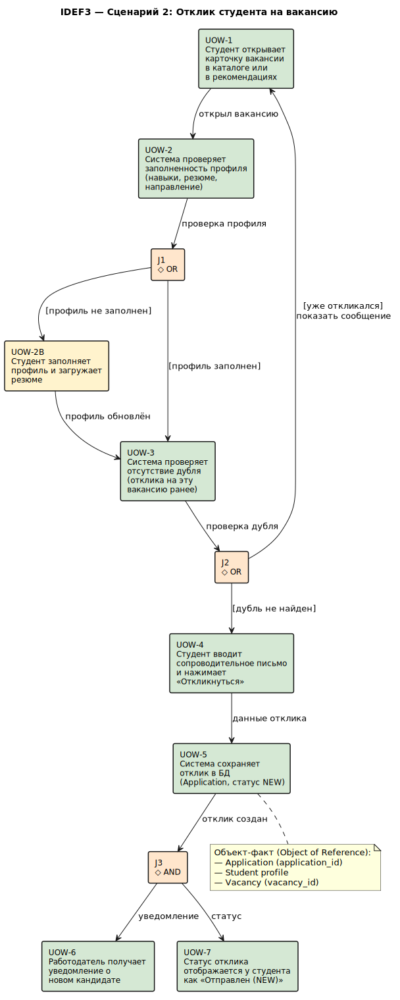

<small>IDEF3 показывает сценарий выполнения процесса и порядок шагов.</small>

### DFD

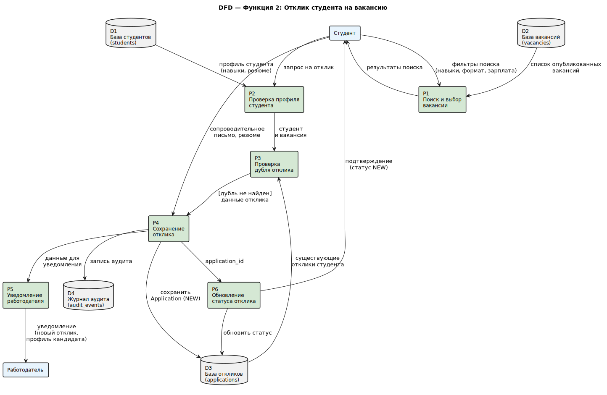

<small>DFD показывает потоки данных между участниками, процессами и хранилищами.</small>

## Функция 3. Рекомендации вакансий

### IDEF0

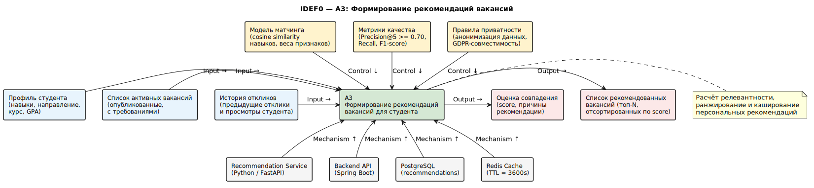

<small>IDEF0 показывает входы, выходы, управляющие факторы и механизмы выполнения функции.</small>

### IDEF3

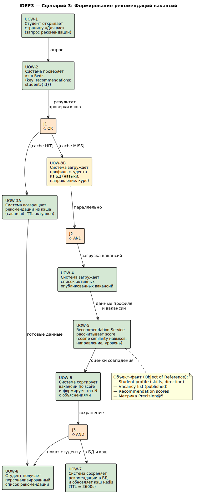

<small>IDEF3 показывает сценарий выполнения процесса и порядок шагов.</small>

### DFD

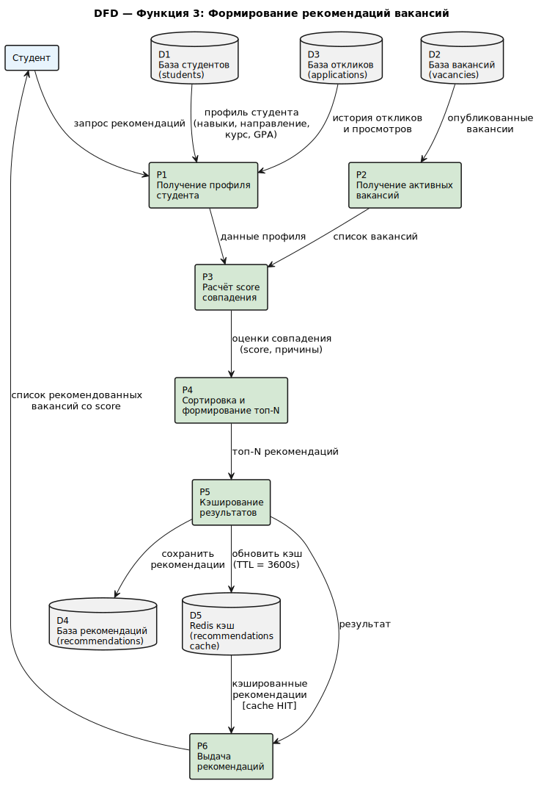

<small>DFD показывает потоки данных между участниками, процессами и хранилищами.</small>

## Функция 4. Интервью и статусы

### IDEF0

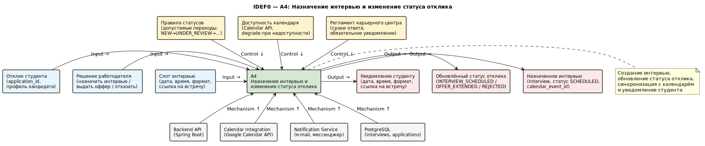

<small>IDEF0 показывает входы, выходы, управляющие факторы и механизмы выполнения функции.</small>

### IDEF3

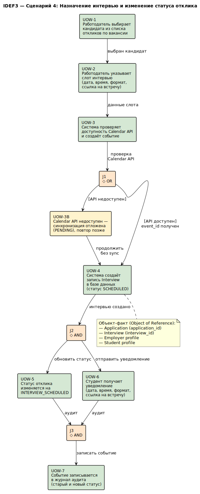

<small>IDEF3 показывает сценарий выполнения процесса и порядок шагов.</small>

### DFD

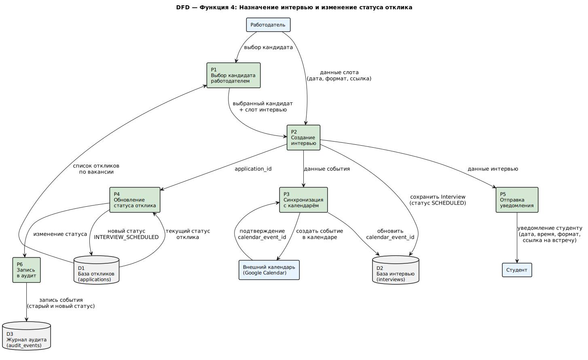

<small>DFD показывает потоки данных между участниками, процессами и хранилищами.</small>
