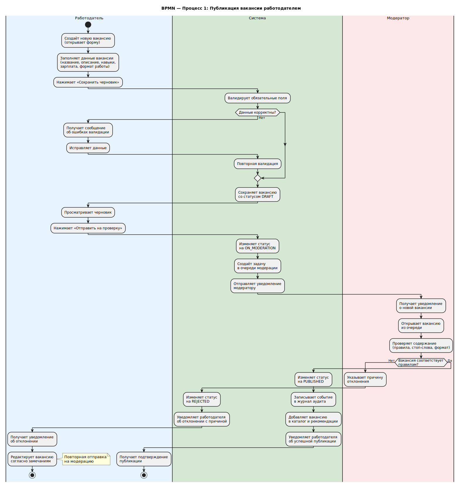
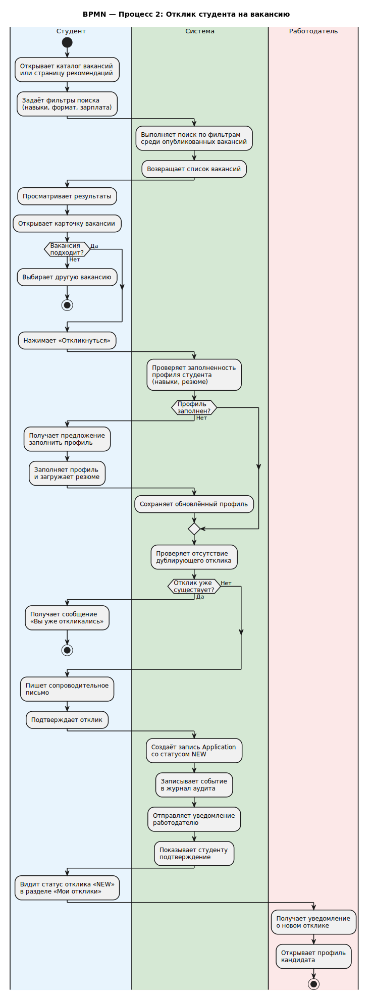
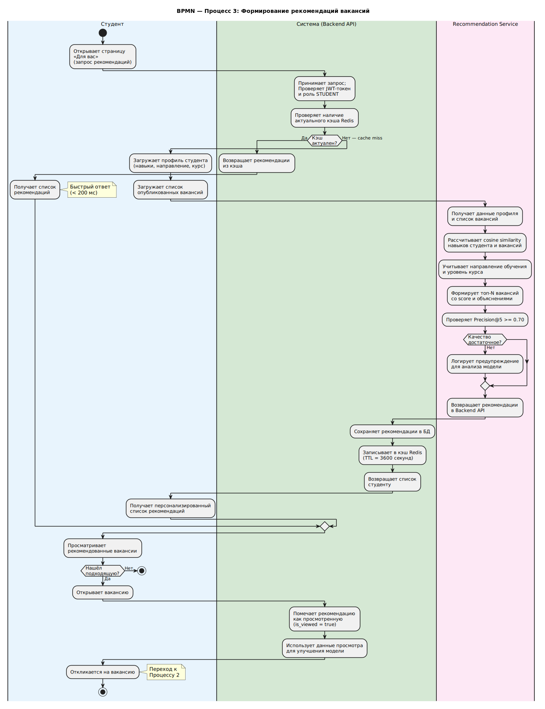
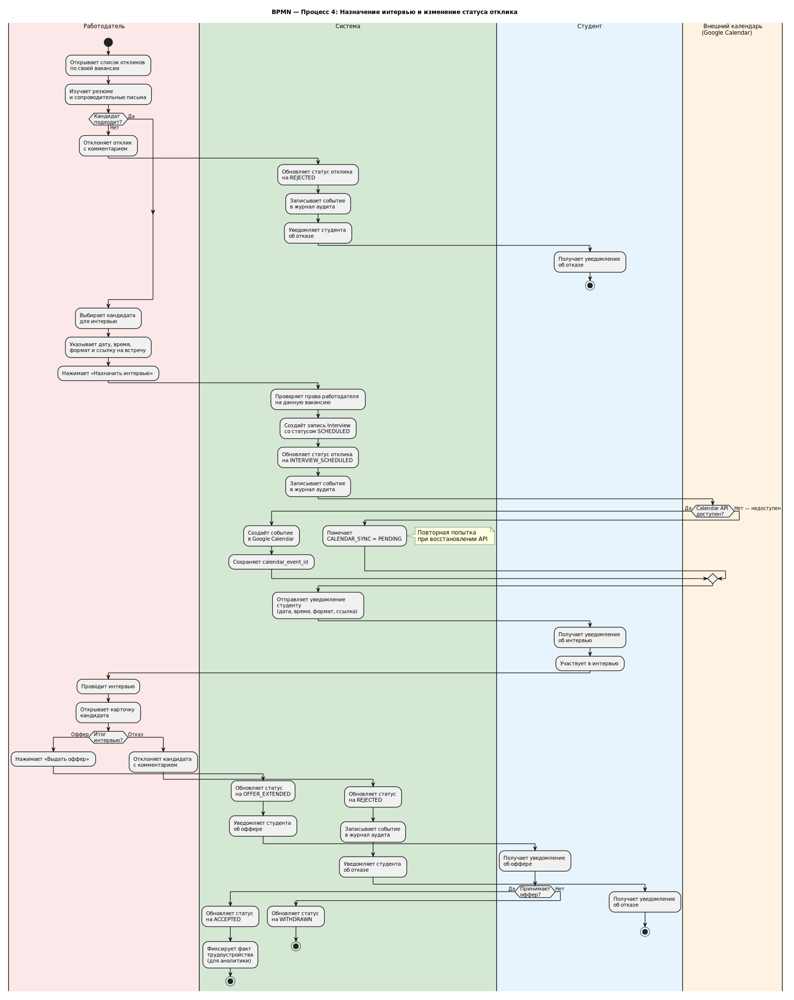

# BPMN-сценарии

BPMN-диаграммы описывают бизнес-процессы для четырёх основных сценариев системы. Они помогают показать не только техническую часть, но и реальное взаимодействие участников.

## 1. Публикация вакансии

<small>BPMN-сценарий показывает последовательность действий и принятие решений в процессе.</small>

## 2. Отклик студента

<small>BPMN-сценарий показывает последовательность действий и принятие решений в процессе.</small>

## 3. Расчёт рекомендаций

<small>BPMN-сценарий показывает последовательность действий и принятие решений в процессе.</small>

## 4. Назначение интервью

<small>BPMN-сценарий показывает последовательность действий и принятие решений в процессе.</small>
