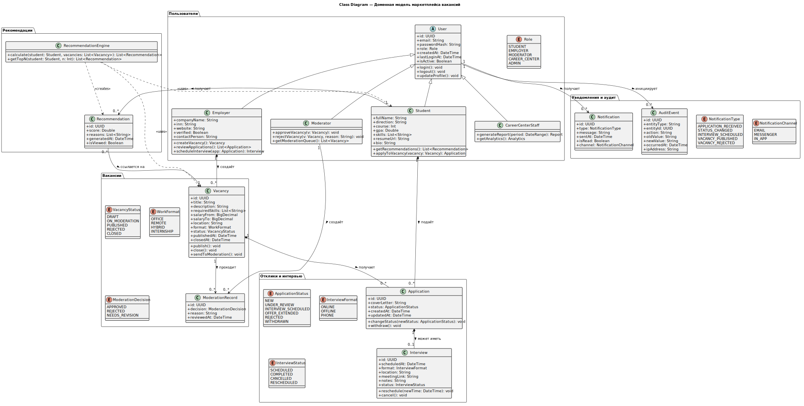

# Обзор UML-моделей

UML-диаграммы в проекте описывают четыре основные функции системы. Диаграммы вставлены как изображения, чтобы документация открывалась без дополнительных инструментов.

## Общая Use Case Diagram

<small>Общая диаграмма вариантов использования системы.</small>

## Общая Class Diagram

<small>Общая доменная модель системы.</small>

## Общая Component Diagram

<small>Компонентная схема сервисов.</small>

## Deployment Diagram

<small>Схема развёртывания системы.</small>

