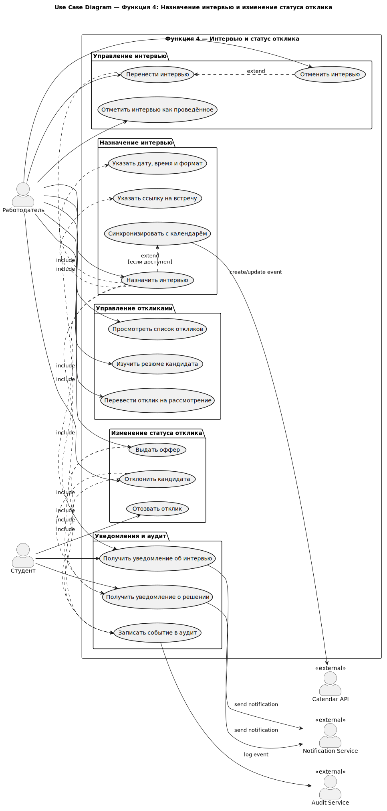
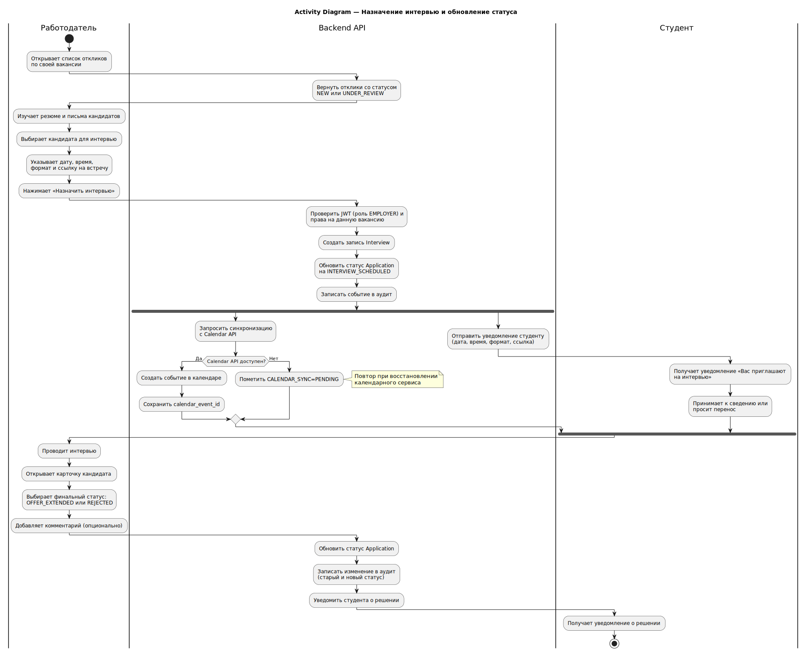
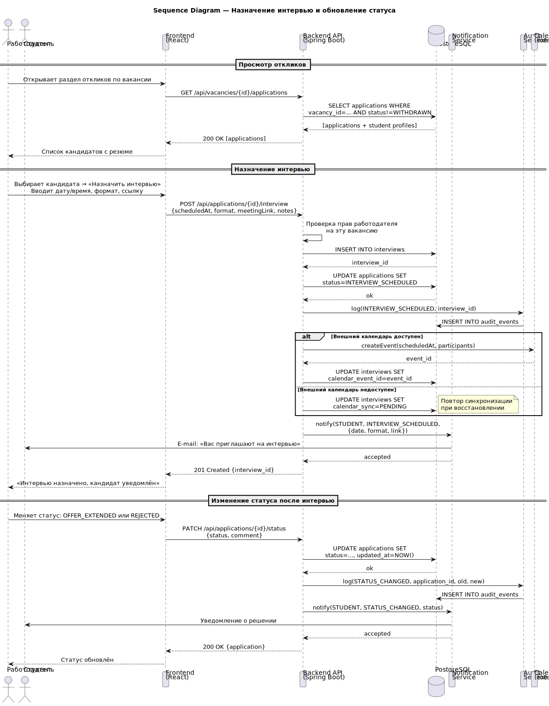
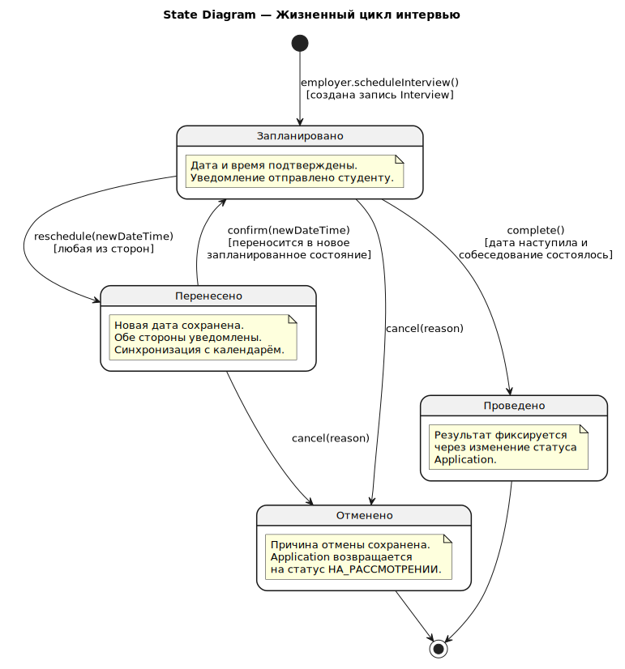
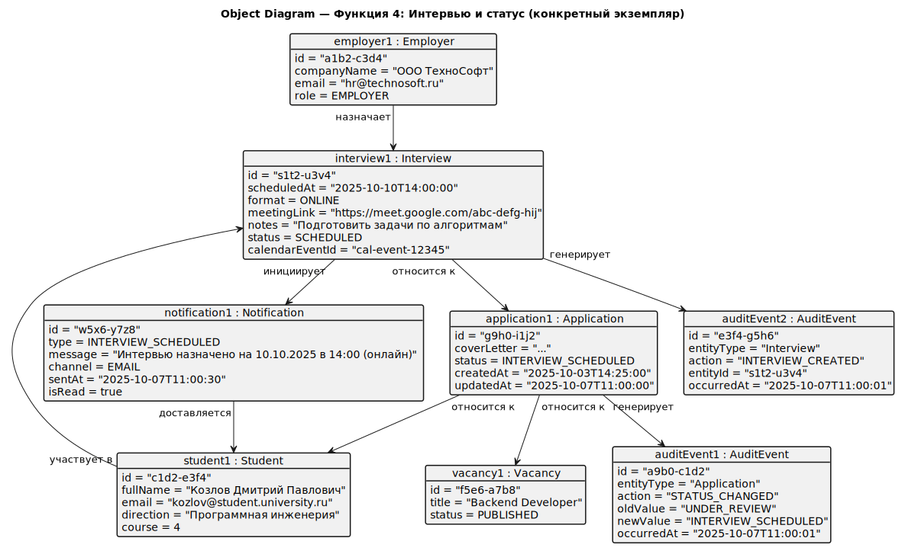

# Функция 4. Интервью и статусы

Диаграммы ниже относятся к выбранной функции системы и вставлены как готовые SVG-изображения.

## Use Case

<small>Варианты использования для интервью и статусов.</small>

## Activity

<small>Диаграмма активности назначения интервью.</small>

## Sequence

<small>Последовательность взаимодействий при интервью.</small>

## State

<small>Жизненный цикл интервью.</small>

## Object

<small>Объекты, участвующие в назначении интервью.</small>

## Deployment

<small>Схема развёртывания, применимая к сценарию интервью.</small>
