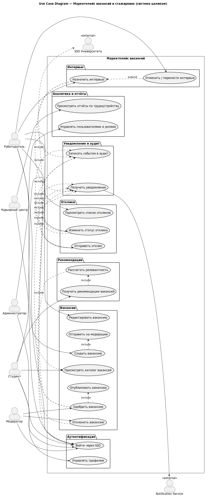
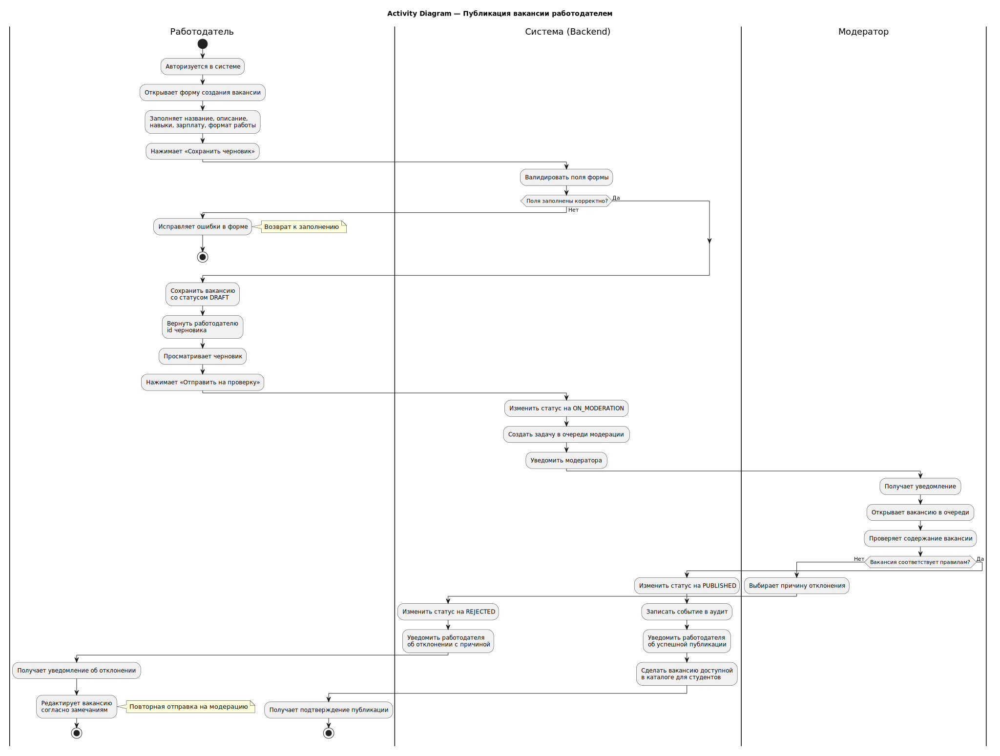
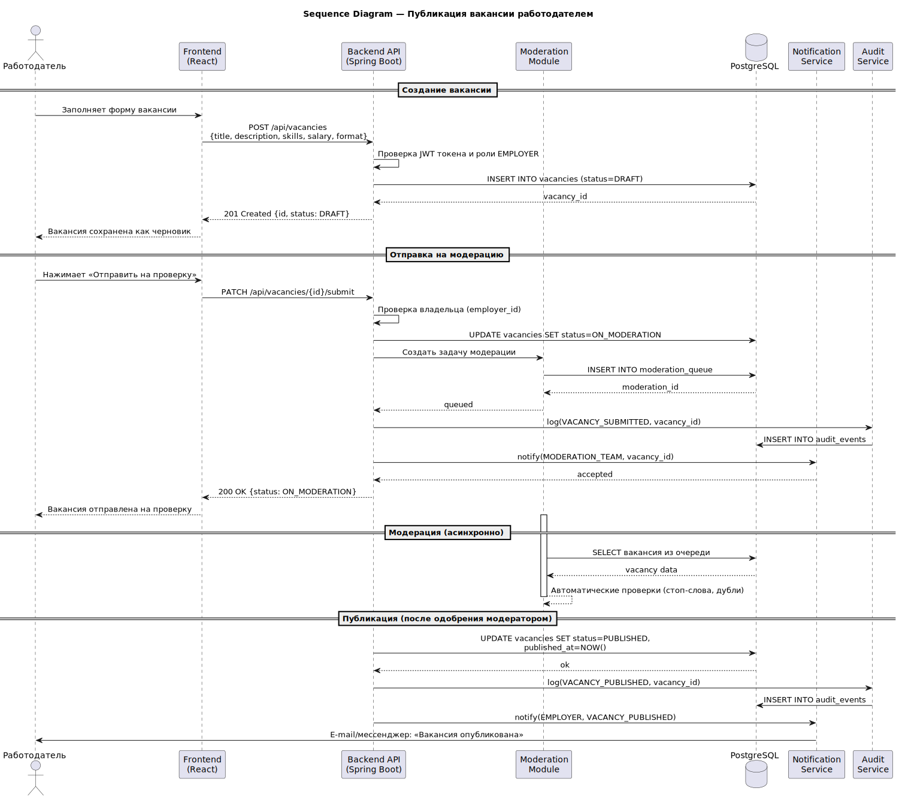
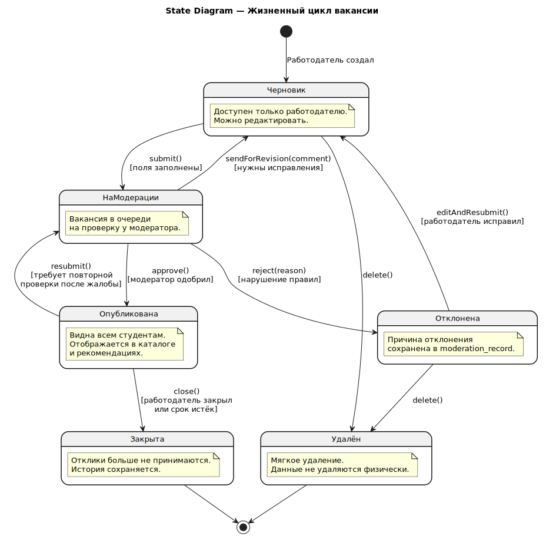
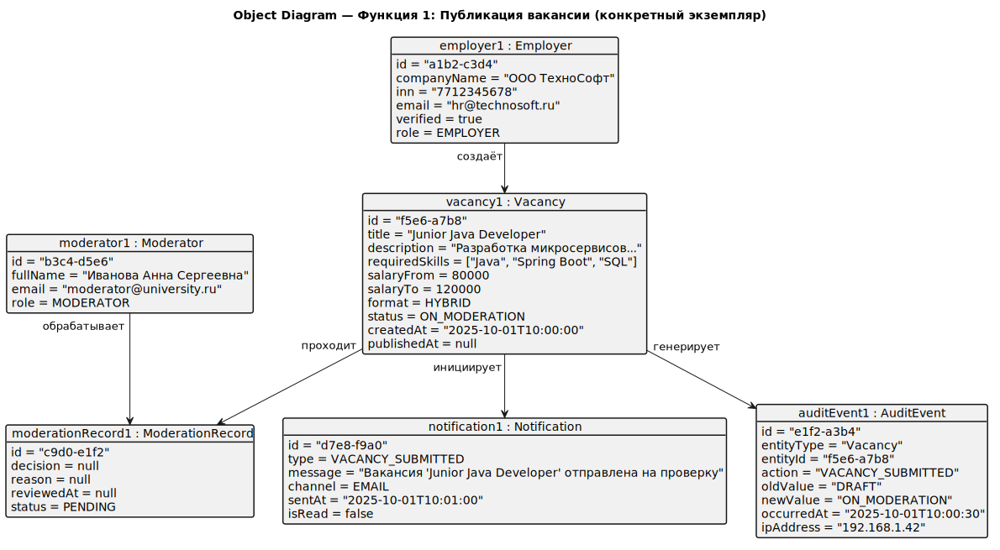

# Функция 1. Публикация вакансии

Диаграммы ниже относятся к выбранной функции системы и вставлены как готовые SVG-изображения.

## Use Case

<small>Общая Use Case Diagram используется для сценария публикации вакансии работодателем.</small>

## Activity

<small>Диаграмма активности процесса публикации вакансии.</small>

## Sequence

<small>Последовательность взаимодействий при публикации вакансии.</small>

## State

<small>Жизненный цикл вакансии.</small>

## Object

<small>Объекты, участвующие в публикации вакансии.</small>

## Component

<small>Компонентная схема, применимая к функции публикации.</small>
