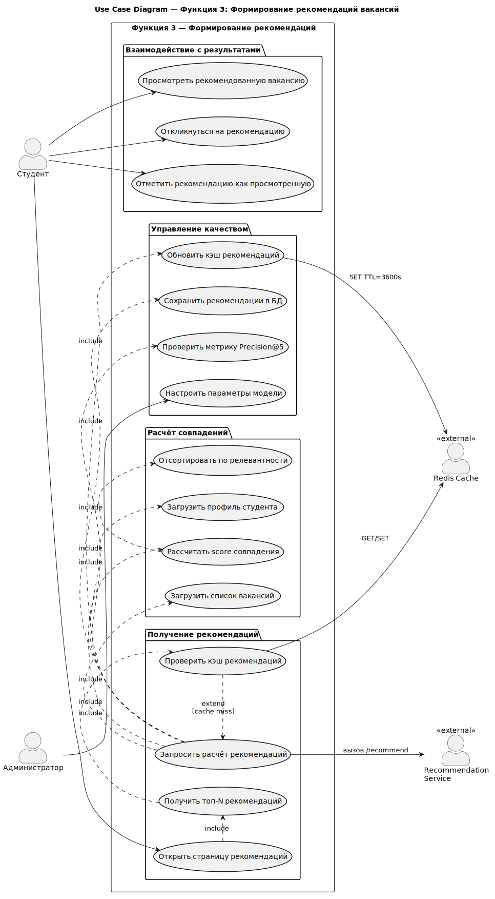
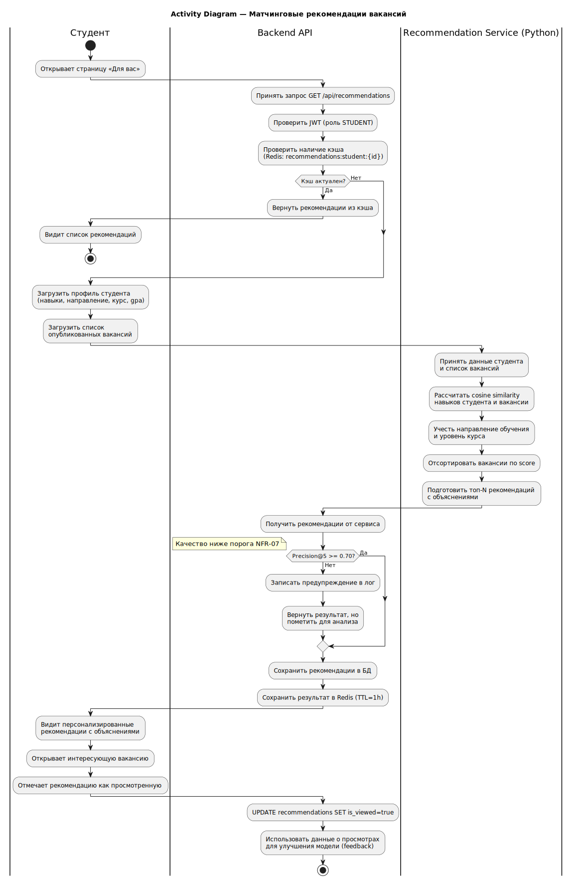
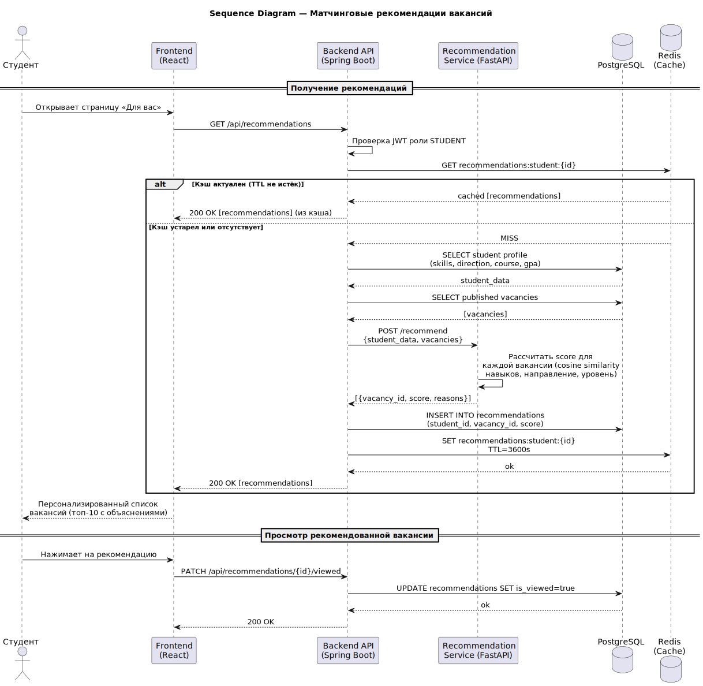
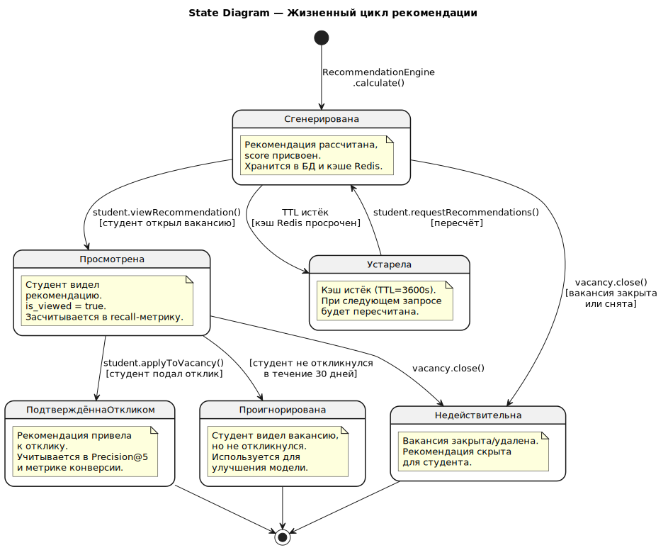
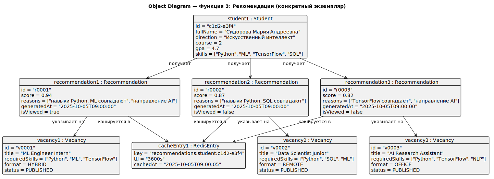

# Функция 3. Рекомендации

Диаграммы ниже относятся к выбранной функции системы и вставлены как готовые SVG-изображения.

## Use Case

<small>Варианты использования для рекомендаций.</small>

## Activity

<small>Диаграмма активности формирования рекомендаций.</small>

## Sequence

<small>Последовательность вызовов при расчёте рекомендаций.</small>

## State

<small>Состояния рекомендации.</small>

## Object

<small>Объекты, участвующие в формировании рекомендаций.</small>

## Component

<small>Компоненты, связанные с рекомендациями.</small>
