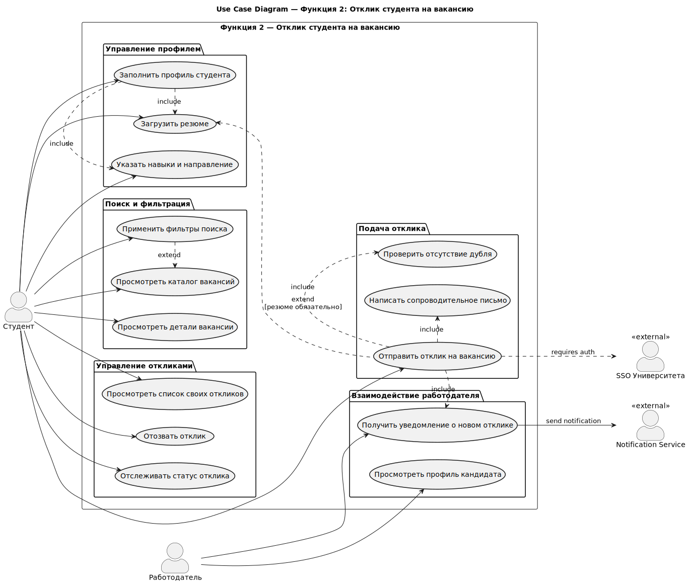
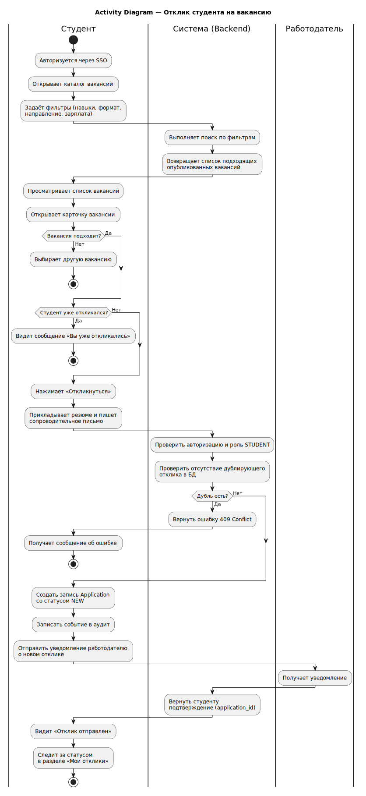
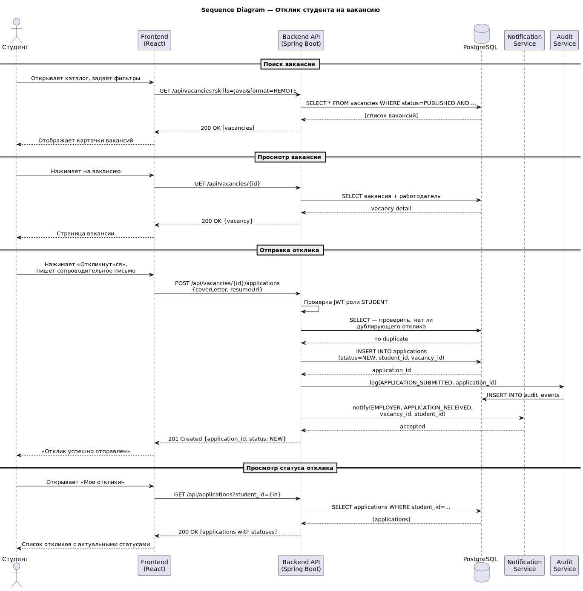
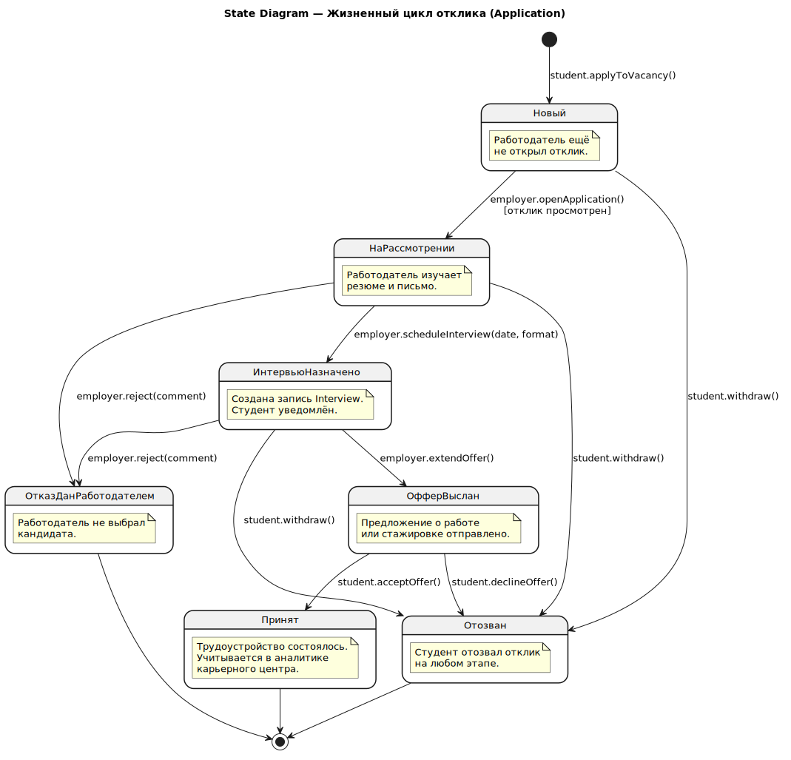
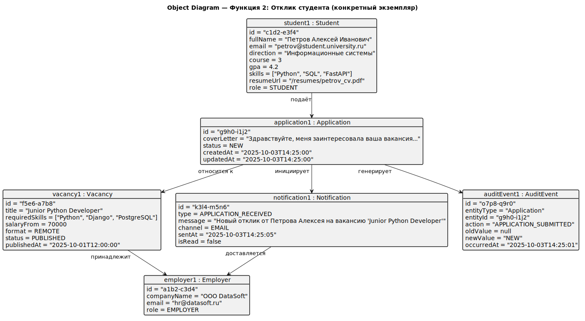
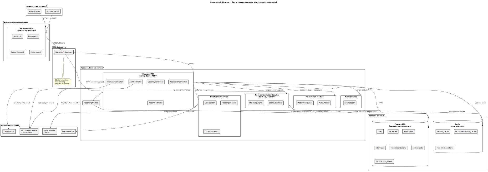

# Функция 2. Отклик студента

Диаграммы ниже относятся к выбранной функции системы и вставлены как готовые SVG-изображения.

## Use Case

<small>Варианты использования для отклика студента.</small>

## Activity

<small>Диаграмма активности отклика студента.</small>

## Sequence

<small>Последовательность взаимодействий при отклике.</small>

## State

<small>Жизненный цикл отклика.</small>

## Object

<small>Объекты, участвующие в отклике студента.</small>

## Component

<small>Компоненты, задействованные в обработке отклика.</small>
